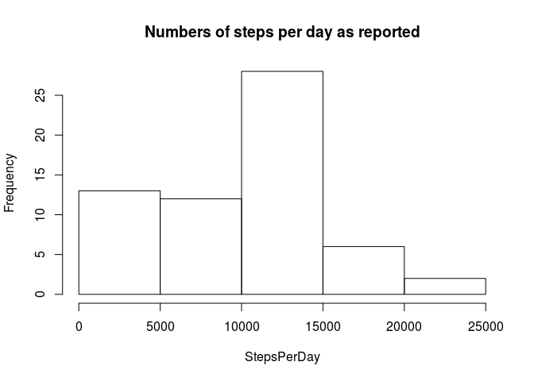
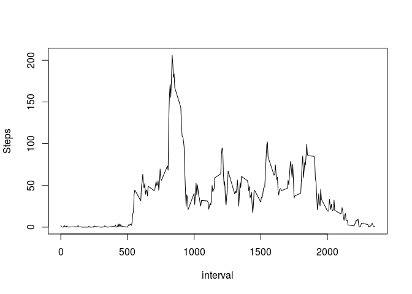
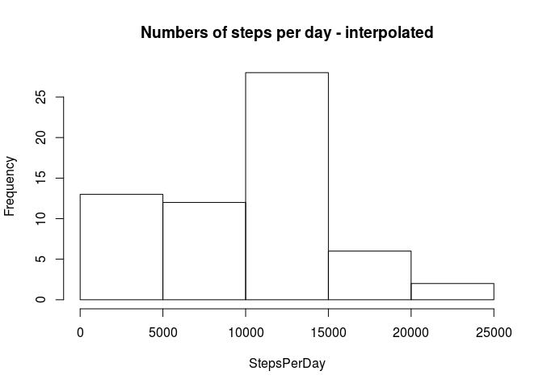
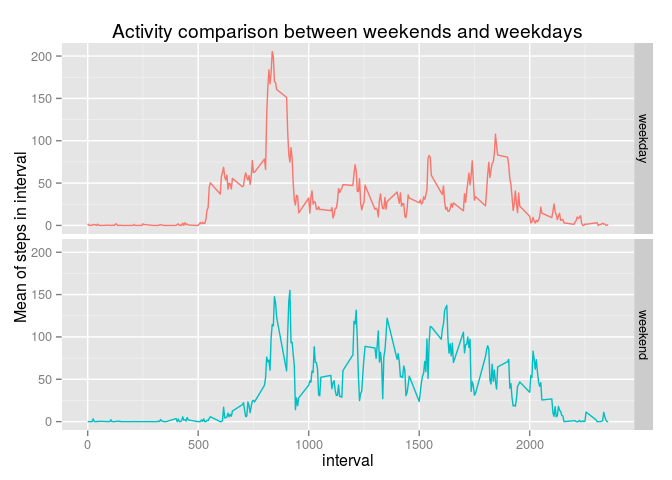

# Reproducible Research: Peer Assessment 1

## Loading and preprocessing the data

```r
        library("ggplot2")
        unzip("activity.zip")
        Activity<-read.csv("activity.csv")
        Activity$date<-as.POSIXct(as.Date(Activity$date))
```


## What is mean total number of steps taken per day?
To analyse this I aggregate the data, summing over all intervals in a given day:

```r
        DailySteps<-with(Activity, aggregate(steps, by=list(date), sum, na.rm=TRUE))
        names(DailySteps)[2]<-"StepsPerDay"
```

I show a histogram of the daily number of steps, as well as a histogram disregarding days with zero steps - these probably represent missing data. 


```r
        with(DailySteps, hist(StepsPerDay,
                              main="Numbers of steps per day as reported"))
```

 


```r
        MeanDailyStep<-mean(DailySteps$StepsPerDay)
        MedianDailyStep<-median(DailySteps$StepsPerDay)
```

The mean number of steps taken daily is 9354.2 and the median is 10395


## What is the average daily activity pattern?

To analyse the typical daily routine, I will now summarise the dataset over all days, joining all activity in the same 5-minute interval


```r
        TimeSteps<-with(Activity, aggregate(steps, by=list(interval), mean, na.rm=TRUE))
        names(TimeSteps)<-c("interval","Steps")
```
The mean daily pattern of actifity presents as follows


```r
        with(TimeSteps, 
             plot(x=interval, y=Steps, type="l"))
```

 


```r
        BusyTime<-with(TimeSteps, interval[which.max(Steps)])
```

The busiest time of day seems to be  at the interval named 835

## Imputing missing values


```r
        NAs<-sum(is.na(Activity$steps))
```
###Interpolating missing values
The data are significantly polluted with 2304 missing values. To get a better view on daily activity, these have to be interpolated. I will take the median value of activity in that time interval and imput that in place of the missing value. For this I nearly repeat the beginning of the previous part:


```r
        TimeStepsMed<-with(Activity, aggregate(steps, by=list(interval), median, na.rm=TRUE))
        names(TimeStepsMed)<-c("interval","Steps")
```

To keep from polluting the original dataset with artificial values I will do that in a new one. 


```r
        ActivityNoNA<-Activity
        NAlist<-is.na(Activity$steps)
        ActivityNoNA$steps[NAlist]<-
                with(TimeStepsMed,  Steps[match(ActivityNoNA$interval[NAlist],interval)])
```
ActivityNoNA now contains no missing values.

### Reanalysing with interpolated values

Following is a histogram of daily step numbers after filling the blanks.


```r
        DailySteps<-with(ActivityNoNA, aggregate(steps, by=list(date), sum, na.rm=TRUE))
        names(DailySteps)[2]<-"StepsPerDay"
         with(DailySteps, hist(StepsPerDay,
                              main="Numbers of steps per day - interpolated"))
```

 

```r
        MeanDailyStep<-mean(DailySteps$StepsPerDay)
        MedianDailyStep<-median(DailySteps$StepsPerDay)
```

The operation resulted in the mean becoming 9503.9 and the median  10395. The median is unchanged and the mean has increased.


## Are there differences in activity patterns between weekdays and weekends?

I prepare to cut the data with respect to weekend/weekday
        

```r
  ActivityNoNA$WEND<-format(ActivityNoNA$date, format="%w")
        ActivityNoNA$WEND<-ActivityNoNA$WEND=="0"|ActivityNoNA$WEND=="6"
        ActivityNoNA$WEND<-as.factor(ActivityNoNA$WEND)
        levels(ActivityNoNA$WEND)<-c("weekday", "weekend")
```

We plot the data, segregating by the newly created factor.


```r
        TimeSteps<-with(ActivityNoNA, aggregate(steps, by=list(interval, WEND), mean, na.rm=TRUE))
        names(TimeSteps)<-c("interval","day_type", "Mean_steps")
        
                g<-ggplot(data=TimeSteps) 
                g<-g+geom_line(aes(x=interval, y=Mean_steps, colour=day_type) ) 
                g<-g+guides(colour=FALSE)
                g<-g+facet_grid(day_type ~ .) 
                g<-g+ylab("Mean of steps in interval") 
                g<-g+ ggtitle("Activity comparison between weekends and weekdays") 
        
        g
```

 
